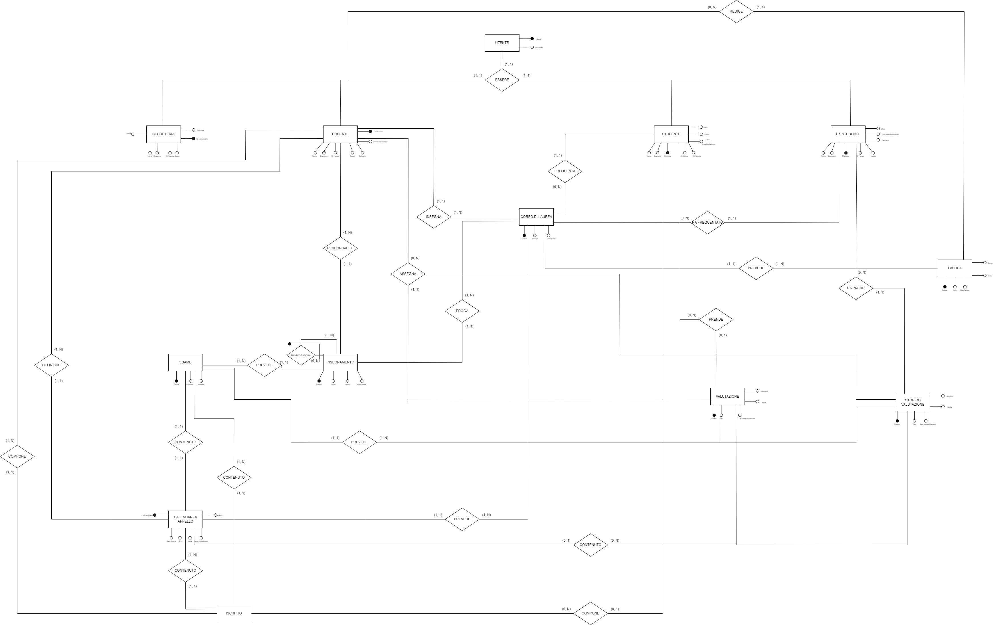

# DOCUMENTAZIONE PROGETTUALE BASI DI DATI - Andrea Galliano 05460A

## INDICE

- [Introduzione](#introduzione)
- [Analisi dei requisiti](#studio-della-realtà-dinteresse-e-analisi-dei-requisiti)
- [Progettazione concettuale](#progettazione-concettuale)
- [Progettazione logica](#progettazione-logica)
    - [Normalizzazione](#normalizzazione)
- [Vincoli intrarelazionali](#vincoli-intrarelazionali)
- [Scrittura del Database](#scrittura-del-database)
    - [Procedure](#procedure)
    - [Trigger](#trigger)
    - [Funzioni](#funzioni)


## INTRODUZIONE:
Il progetto d'esame prevede la realizzazione di una piattaforma di gestione di insegnamenti ed esami universitari, con relativo controllo di tutte le entità e funzionalità che la piattaforma stessa deve avere per funzionare in maniera corretta.  
La proposta di soluzione è atta a rappresentare fedelmente e in maniera completa la realtà d'interesse, scongiurando possibilità di dati incosistenti, duplicati e/o  ambiguità. Ogni scelta implementativa è opportunamente motivata per far funzionare tutti i punti che compongono il progetto (database relazionale con funzioni e trigger e applicativo web che si interfaccia con il DB per la visualizzazione dei dati).

## Studio della realtà d'interesse e analisi dei requisiti:
Il primo passo per realizzare al meglio la base di dati è studiare approfonditamente la realtà d'interesse e analizzare i requisiti in modo tale da avere un'idea solida su come realizzare uno schema concettuale completo.  
Partendo con ordine, la prima cosa che salta all'occhio è la necessità di realizzazione delle utenze che compongono il database, proprio per questo motivo sono necessarie le seguenti 4 entità:  
1. **UTENTE** : si tratta di un qualsiasi individuo, facente parte del DB, che è in grado di interfacciarsi con le relative funzionalità mediante un opportuno sistema di autenticazione (nel nostro caso si è optato per una *classica* autenticazione realizzata tramite email e password).  
Ciò che ci permette di identificare univocamente ogni utente è proprio la mail.  
Salta subito all'occhio che non tutti gli utenti sono uguali ed è essenziale *scomporli* grazie alle 3 entità elencate sotto;  
2. **SEGRETERIA** : è l'entità che rappresenta un qualsiasi membro della segreteria dell'università, che deve poter essere opportunamente identificato e svolgere le attività classiche per un qualsiasi membro di una segreteria della realtà d'interesse (vedremo più avanti che proprio il profilo del segreterio/a gode di particolari libertà all'interno dell'applicativo web, soprattutto se comparato agli altri utenti del sistema).  
Ogni membro della segreteria dovrà presentare quindi un codice identificativo (ID), il proprio nome, cognome, codice fiscale, il sesso, il numero di telefono e il suo ruolo (che può dividersi in *primo livello* e *secondo livello*).
3. **DOCENTE** : si tratta dei prof. che gestiscono tutto ciò che concerne gli insegnamenti, gli esami, i calendari ecc...  
Un docente è composto dal suo ID, dal nome, cognome, dal codice fiscale, dal sesso, il numero di telefono e dalla sua carica accademica (che si divide in *ordinario*, *associato* e *ricercatore*).  
Intuitivamente si capisce subito che la chiave primaria che comporrà questa entità dovrà essere chiave esterna per tutte le altre relative alla gestione delle funzionalità del docente stesso.
4. **STUDENTE** : sono gli studenti iscritti ai vari corsi di laurea dell'ateneo e sono identificati univocamente tramite il loro numero di matricola. Possono iscriversi agli esami, prendere valutazione e conseguire la laurea.  
Oltre alla matricola, uno studente presenta il proprio nome e cognome, il codice fiscale, il sesso, il numero di telefono, la data di immatricolazione e lo stato (che può essere *in corso* o *fuoricorso*).
5. **EX STUDENTE** : sono gli studenti che hanno terminato il loro percorso di studi; all'interno di questa entità sono compresi sia gli studenti che hanno terminato gli studi tramite conseguimento della laurea, sia quelli che hanno effettuato la rinuncia. Devono comunque poter avere un vero e proprio archivio dati sul loro percorso universitario passato e si interfacciano con la base di dati tramite login e password, esattamente come gli altri utenti.  
I suoi attributi sono esattamente gli stessi dello studente attualmente iscritto, con la differenza che *fanno tutti parte del passato*.

Una volta assimilate le utenze da realizzare, è il momento di analizzare le restanti entità che compongono la base di dati: dapprima risulta necessaria la gestione dei vari corsi di laurea, dei relativi insegnamenti ed esami e, conseguentemente, anche del relativo calendario degli appelli d'esame.  
Successivamente ci si occuperà delle valutazioni che un docente dà (e che, parallelamente, uno studente riceve) e del conseguimento della laurea da parte degli studenti.  
Infine è bene comporre correttamente un __archivio__ che faccia in modo *conservare* le valutazioni passate degli ex studenti.  
Dunque, seguendo proprio l'ordine dell'analisi appena fatta abbiamo:  
1. **CORSO DI LAUREA** : un corso di laurea è identificato da un proprio codice, dalla tipologia (*triennale*, *magistrale* o a *ciclo unico*) e la descrizione (ovvero il nome).
2. **INSEGNAMENTO** : si tratta del corso di cui un docente è responsabile effettuando le lezioni durante il semestre. Ogni insegnamento è caratterizzato da un proprio codice identificativo, dal nome, l'anno accademico in cui è previsto (da 1 a 3 per i corsi di laurea triennali, da 1 a 2 per i corsi di laurea magistrali e da 1 a 5 per i corsi di laurea a ciclo unico) e una breve descrizione.  
Va fatta particolare attenzione soprattutto alla gestione della propedeuticità degli insegnamenti, che all'interno dello schema concettuale e non solo svolge un ruolo molto importante.
3. **ESAME** : un esame è l'entità che rappresenta la verifica che un docente effettua per capire che gli studenti abbiano appreso le nozioni del corso svolto durante un semestre.
Presenta 3 caratteristiche fondamentali: un codice identificativo, la tipologia (*a distanza* oppure *in presenza*) e la modalità (*scritto*, *orale* o *scritto + orale*).
4. **CALENDARIO** : l'entità calendario non è altro che la rappresentazione degli appelli d'esame che compongono un particolare corso di laurea. Ogni calendario/appello è formato da un codice, da un attributo che segnali se si tratta di un appello aperto oppure chiuso, dalla data dell'esame, dall'ora, dall'aula e dall'anno accademico.
5. **ISCRITTO** : l'entità iscritto non è altro che una tabella che tiene traccia di tutti gli studenti che si iscrivono ad un certo appello e ha come attributi le chiavi primarie delle entità **docente**, **studente**, **esame** e **calendario**. Sarà di fondamentale importanza per le interrogazioni al database (soprattutto grazie alla clausola **JOIN**).
6. **VALUTAZIONE** : questa entità non fa altro che tenere traccia di tutti i voti assegnati da parte dei docenti agli studenti che si sono iscritti ad un certo appello e hanno quindi sostenuto l'esame.  
Per ogni valutazione abbiamo un codice che la identifichi, il voto che ha conseguito lo studente, l'eventuale lode, un attributo che faccia capire se è stato respinot e la data di verbalizzazione.
7. **LAUREA** : nel momento in cui un qualsiasi studente termina il proprio percorso di studi e consegue la laurea, è opportuno che vi sia un'entità che tenga traccia di tutti i dati che riguardano la laurea stessa dell'ormai ex studente dell'università.  
La laurea, esattamente come le altre entità che compongono il DB, viene univocamente identificata tramite un codice, ha un voto, la lode, eventuali punti di bonus acquisiti in sede di laurea e la data.
8. **STORICO VALUTAZIONE** : un qualsiasi ex studente deve poter avere sempre a propria disposizione, oltre ai dati riguardanti la laurea nel caso in cui fosse arrivato a termine del percorso di studi, **tutta** la propria carriera. Chiaramente questo è possibile perché, anche dopo la rinuncia agli studi o al raggiungimento del titolo di studio, l'ex studente rimane comunque all'interno del sistema e la sua mail e password sono attive e valide.  

## PROGETTAZIONE CONCETTUALE:  
Alla luce di ciò che abbiamo ipotizzato nel corso dell'analisi dei requisiti, è possibile comporre una prima versione di uno **schema entità-relazione** che tenga conto di tutte le proprietà delle entità e di come esse sono collegate fra di loro mediante relazioni.
Oltre a questo, è opportuno comporre lo schema E.R. indicando anche le cardinalità che presentano le relazioni.  

  
  
Come è possibile evincere dallo schema sopra riportato, vi è una gerarchia padre-figli riguardante gli utenti che compongono la base di dati e quelli che sono effettivamente i fruitori del sistema: i membri della segreteria, i docenti, gli studenti e gli ex studenti.  
Come ci suggeriscono le regole di composizione di un qualsiasi DB, le generalizzazioni sono una semplificazione necessaria in fase di progettazione concettuale, che però non trovano realizzazione effettiva dalla fase di progettazione logica in poi. Diventa dunque necessaria una ristrutturazione di questo schema Entity Relationship, facendo in modo tale che l'entità padre sia **collegata alle figlie tramite una relazione** con carinalità 1:1.  

__Ecco lo schema concettuale aggiornato:__

  
<br>
Un appunto necessario riguardante questo schema *Entity Relationhip* riguarda l'associazione ricorsiva **PROPEDEUTICITA'**, che risulta di fondamentale gestione per quanto concerne lo schema logico (sarà di fatto un'ulteriore relazione), per la realizzazione vera e propria del DB e per tutte le funzionalità dell'applicativo web, in particolare per quanto riguarda ciò che potrà fare/non fare lo studente.

## PROGETTAZIONE LOGICA:
Una volta conclusa la fase di progettazione concettuale, è tempo di concentrarsi sulla progettazione logica, andando a creare le relazioni e andando ad applicare, ove necessaario, le opportune regole di normalizzazione.  
Coerentemente con le regole di composizione dello schema logico, andranno sottolineate eventuali chiavi primarie e/o esterne.  
<br>
*Lo schema logico si presenta al momento così:*  
- **Corsi di laurea** (<u>Codice</u>, tipologia, descrizione)
- **Utenti** (<u>E-mail</u>, password)  
- **Studenti** (<u>Matricola</u>, nome, cognome, codice fiscale, sesso, cellulare, data immatricolazione, stato, *utente email*)  
- **Docenti** (<u>ID docente</u>, nome, cognome, codice fiscale, sesso, cellulare, carica accademica, *utente email*)  
- **Segreteria** (<u>ID</u>, nome, cognome, codice fiscale, sesso, cellulare, ruolo, *utente email*)  
- **Ex Studenti** (<u>Matricola</u>, nome, cognome, codice fiscale, sesso, cellulare, stato, *utente email*)  
- **Lauree** (<u>Codice</u>, ex studente, *relatore*, voto, data laurea, lode, punti bonus) 
- **Insegnamenti** (<u>Codice</u>, nome, anno esame, descrizione, *docente*, *corso di laurea*)   
- **Propedeuticità** (<u>*Esame propedeutico*</u>, <u>*esame con propedeuticità*</u>)
- **Esami** (<u>Codice</u>, *insegnamento*, tipologia, modalità)  
- **Calendari** (<u>Codice appello</u>, *esame*, *docente*, data esame, ora, aula, aperto, anno accademico)  
- **Iscritti** (<u>*docente*</u>, <u>*studente*</u>, <u>*esame*</u>, <u>*calendario*</u>)  
- **Valutazioni** (<u>Codice valutazione</u>, *studente*, *calendario*, *esame*, *docente*, voto, lode, respinto, data di verbalizzazione)  
- **Storico Valutazioni** (<u>Codice valutazione</u>, *studente*, *calendario*, *esame*, *docente*, voto, lode, respinto, data di verbalizzazione)  

### NORMALIZZAZIONE:
Lo schema logico non presenta relazioni ed attributi che risultano predisposti all'inconsistenza dei dati e ad evenutali violazioni delle 4 regole di normalizzazione.  
In particolare, va posto l'accento sull'attributo *__voto__* della relazione __*valutazioni*__ e __*storico valutazioni*__, che dopo un'analisi iniziale potrebbe potrebbe pensare possa assumere, oltre alla classica forma del voto in trentesimi compreso fra 18 e 30, anche quella testuale di "*respinto*"; questo non risulta però corretto nel momento in cui si va ad applicare la **prima regola di normalizzazione**, che esprime il concetto di __*atomicità*__ degli attributi. Esattamente per questo motivo, è ragionevole avvalersi sia di un attributo *__voto__* numerico (che non presenti clausole di nullità, ma che sia compreso all'interno del dominio fra 18 e 30), sia di un attributo *__respinto__* boolean, che certifichi se il superamento o il mancato superamento di un certo esame da parte dello studente. Per le funzionalità necessarie al completo funzionamento del progetto, inoltre, l'attributo *__respinto__*, al contrario di *__voto__*, non deve essere nullo ([qui tutti i vincoli](#vincoli-intrarelazionali)).

## VINCOLI INTRARELAZIONALI:
Prima di realizzare la base di dati e scrivere in linguaggio SQL il dump, è bene definire tutti i vincoli intrarelazionali del sistema e tutti i domini degli attributi che andranno a comporre le tabelle.  
Oltre a questo, è buona prassi definire ragionevolmente anche i tipi di dato di cui necessitano gli attributi, andando a sceglieri quelli che fanno al caso preso in esame.  

|RELAZIONE   |ATTRIBUTO   |TIPO|VINCOLO INTRARELAZIONALE  |DOMINIO|
|---------   |--------|--------|---------|----|
|**UTENTE**  |**email**|varchar|PRIMARY KEY|
|            |pw|varchar|NOT NULL|
|   |   |   |   |
|**SEGRETERIA**|**ID**|serial|PRIMARY KEY|
|            |Nome|varchar|NOT NULL|
|            |Cognome|varchar|NOT NULL|
|            |CodFiscale|varchar|NOT NULL, UNIQUE, MAX_LENGTH = 16|
|            |Sesso|ENUM|NOT NULL|Sesso = {'M', 'F', 'Non specificato'} |
|            |Cellulare|varchar|NOT NULL, UNIQUE, MAX_LENGTH = 10|
|            |Ruolo|ENUM|NOT NULL|Ruolo = {'Primo livello', 'Secondo livello'}|
|            |Utente email|varchar|FOREIGN KEY, NOT NULL|
|   |   |   |   |
|**DOCENTE** |**ID**|serial|PRIMARY KEY|
|            |Nome|varchar|NOT NULL|
|            |Cognome|varchar|NOT NULL|
|            |CodFiscale|varchar|NOT NULL, UNIQUE, MAX_LENGTH = 16|
|            |Sesso|ENUM|NOT NULL|Sesso = {'M', 'F', 'Non specificato'} |
|            |Cellulare|varchar|NOT NULL, UNIQUE, MAX_LENGTH = 10|
|            |Carica accademica|ENUM|NOT NULL|Carica accademica = {'Ordinario', 'Associato', 'Ricercatore'}|
|            |Utente email|varchar|FOREIGN KEY, NOT NULL|
|   |   |   |   |
|**STUDENTE**|**Matricola**|varchar|PRIMARY KEY|
|            |Nome|varchar|NOT NULL|
|            |Cognome|varchar|NOT NULL|
|            |CodFiscale|varchar|NOT NULL, UNIQUE, MAX_LENGTH = 16|
|            |Sesso|ENUM|NOT NULL|Sesso = {'M', 'F', 'Non specificato'} |
|            |Cellulare|varchar|NOT NULL, UNIQUE, MAX_LENGTH = 10|
|            |Data immatricolazione|date|NOT NULL|
|            |Stato|ENUM|NOT NULL|Stato = {'In corso', 'Fuoricorso'}|
|            |Utente email|varchar|FOREIGN KEY, NOT NULL|
|   |   |   |   |
|**EX STUDENTE**|**Matricola**|varchar|PRIMARY KEY|
|               |Nome|varchar|NOT NULL|
|               |Cognome|varchar|NOT NULL|
|               |CodFiscale|varchar|NOT NULL, UNIQUE, MAX_LENGTH = 16|
|               |Sesso|ENUM|NOT NULL|Sesso = {'M', 'F', 'Non specificato'} |
|               |Cellulare|varchar|NOT NULL, UNIQUE, MAX_LENGTH = 10|
|               |Stato|ENUM|NOT NULL|Stato = {'In corso', 'Fuoricorso'}|
|               |Utente email|varchar|FOREIGN KEY, NOT NULL|
|   |   |   |   |
|**CORSO DI LAUREA**|**Codice**|serial|PRIMARY KEY|
|                   |Tipologia|ENUM|NOT NULL|Tipologia = {'Triennale', 'Magistrale', 'A ciclo unico'}|
|                   |Descrizione|varchar|NOT NULL|  
|   |   |   |   |
|**INSEGNAMENTO**|**Codice**|serial|PRIMARY KEY|
|                |Nome|varchar|NOT NULL|
|                |Anno|ENUM|NOT NULL|Anno = {'1', '2', '3', '4', '5'}|
|                |Descrizione|varchar|NOT NULL|
|                |CdL|integer|FOREIGN KEY, NOT NULL|
|                |Docente|integer|FOREIGN KEY, NOT NULL|
|   |   |   |   |
|**PROPEDEUTICITA'**|**Insegnamento propedeutico**|integer|PPK, NOT NULL|
|                   |**Insegnamento con propedeuticità**|integer|PPK, NOT NULL|
|   |   |   |   |
|**ESAME**|**Codice esame**|serial|PRIMARY KEY|
|         |Tipologia|ENUM|NOT NULL|Tipologia = {'Distanza', 'Presenza'}|
|         |Modalità|ENUM|NOT NULL|Modalità = {'Scritto', 'Orale', 'Scritto + Orale'}|
|         |Insegnamento|integer|FOREIGN KEY, NOT NULL|
|         |            |        |   |
|**CALENDARIO**|**Codice appello**|serial|PRIMARY KEY|
|              |Data esame|date|NOT NULL|
|              |Ora|time|NOT NULL|
|              |Aula|varchar|NOT NULL|
|              |Anno accademico|integer|NOT NULL|
|              |Aperto|boolean|NOT NULL|
|              |Docente|integer|FOREIGN KEY, NOT NULL|
|              |CdL|integer|FOREIGN KEY, NOT NULL|
|   |   |   |   |
|**ISCRITTI**|**Docente**|integer|PPK, NOT NULL|
|            |**Studente**|integer|PPK, NOT NULL|
|            |**Esame**|integer|PPK, NOT NULL|
|            |**Calendario**|integer|PPK, NOT NULL|
|   |   |   |   |
|**VALUTAZIONE**|**Codice valutazione**|serial|PPK, NOT NULL|
|               |**Studente**|integer|PPK, NOT NULL|
|               |Calendario|integer|FOREIGN KEY, NOT NULL|
|               |Esame|integer|FOREIGN KEY, NOT NULL|
|               |Docente|integer|FOREIGN KEY, NOT NULL|
|               |Voto|integer|NOT NULL|18 <= Voto <= 30|
|               |Lode|boolean|NOT NULL|
|               |Respinto|boolean|NOT NULL|
|               |Data verbalizzazione|date|NOT NULL|
|   |   |   |   |
|**STORICO VALUTAZIONE**|**Codice valutazione**|serial|PPK, NOT NULL|
|                       |**Ex studente**|integer|PPK, NOT NULL|
|                       |Calendario|integer|FOREIGN KEY, NOT NULL|
|                       |Esame|integer|FOREIGN KEY, NOT NULL|
|                       |Docente|integer|FOREIGN KEY, NOT NULL|
|                       |Voto|integer|NOT NULL|18 <= Voto <= 30|
|                       |Lode|boolean|NOT NULL|
|                       |Respinto|boolean|NOT NULL|
|                       |Data verbalizzazione|date|NOT NULL|
|   |   |   |   |
|**LAUREA**|**Codice**|serial|PRIMARY KEY|
|          |Bonus|integer|NOT NULL|0 <= Bonus <= 6|
|          |Voto|integer|NOT NULL|60 <= Voto <= 110|
|          |data laurea|date|NOT NULL|
|          |Lode|boolean|NOT NULL|
|          |Studente|integer|FOREIGN KEY, NOT NULL|
|          |Relatore|integer|FOREIGN KEY, NOT NULL|
|          |CdL|integer|FOREIGN KEY, NOT NULL|

## SCRITTURA DEL DATABASE:
Dopo aver capito quali sono i tipi di attributi, i loro vincoli intrarelazionali e i domini, si può a tutti gli effetti cominciare a scrivere il database.  
Tutte le tabelle rispettano le clausole riportate sopra ed il codice completo del dump vuoto della base di dati è consultabile [qui]('../../../database/unitua.sql').  
<br>
#### PROCEDURE:
A questo punto sono state aggiunte le normali procedure di popolamento del DB, in modo tale da avere i primi record di prova per testarne il corretto funzionamento. Tutte le procedure sono scritte nel seguente formato:  
```SQL
--Esempio di inserimento record della tabella studente:

CREATE OR REPLACE PROCEDURE unitua.insert_studente(
    matricola varchar(6), 
    nome varchar,
    cognome varchar, 
    codFiscale varchar(16), 
    sesso unitua.sex, 
    cellulare varchar(10), 
    data_immatricolazione date, 
    stato unitua.stato_studente,
    utente_email varchar,
	CdL_codice int
)
AS $$
    BEGIN
        INSERT INTO unitua.studente(matricola, nome, cognome, codFiscale, sesso, cellulare, data_immatricolazione, stato, utente_email, CdL)
        VALUES (matricola, nome, cognome, codFiscale, sesso, cellulare, data_immatricolazione, stato, utente_email, CdL_codice);
    END;
$$ LANGUAGE plpgsql;
```

Il DB prevede anche la presenza di procedure che aggiornino o elimino record dalle tabelle.  
Prendiamo, ad esempio, la procedura che elimina un'iscritto da un appello e quella che aggiorni i valori di una valutazione:  

```SQL
--Procedura che disiscrive uno studente da un appello:
CREATE OR REPLACE PROCEDURE unitua.delete_iscritto (
    docente_in integer,
    matricola_in text,
    esame_in integer,
    calendario_in integer
)
AS $$
    BEGIN
        DELETE FROM unitua.iscritti AS i 
        WHERE i.docente = docente_in AND i.studente = matricola_in AND i.esame = esame_in AND i.calendario = calendario_in;
    END;
$$ LANGUAGE plpgsql;
```

```SQL
--Procedura 2 (promossi) che aggiorna la tabella valutazione dati il codice dell'appello, il codice dell'esame, del docente e la matricola dello studente:
CREATE OR REPLACE PROCEDURE unitua.update_valutazione2 (
	cod_valutazione integer,
    cod_appello integer,
    cod_esame integer, 
    id_doc integer,
    matricola text,
    voto_in integer,
    lode_in boolean
)
AS $$
BEGIN
    UPDATE unitua.valutazione AS v
    SET calendario = cod_appello,
		voto = voto_in,
        lode = lode_in,
		respinto = false
    WHERE v.codice = cod_valutazione AND v.studente = matricola
	AND v.docente = id_doc AND v.esame = cod_esame;
END;
$$ LANGUAGE plpgsql;
```

Per visionare in maniera completa tutte le procedure di inserimento delle tabelle, cliccare sul seguente [link](../database/unitua_popolazione_tabelle.sql).  

Oltre alle procedure di __insert__, __delete__ e __update__ all'interno delle tabelle, il DB è dotato di apposite [funzioni](#trigger) e [trigger](#funzioni) in grado di far funzionare l'intero sistema coerentemente con le istruzioni date dalla traccia.  
Si noti che i trigger e le funzioni realizzate hanno soprattutto lo scopo di scongiurare qualsiasi anomalia di inserimento, cancellazione o aggiornamento da parte dell'utente finale che dovrà interfacciarsi con la base di dati tramite l'applicativo web.  

#### TRIGGER:
Vediamo i __*trigger*__ più rilevanti della proposta di soluzione (per visionarli tutti in maniera completa, cliccare [qui]('../../../database/unitua_popolazione_tabelle.sql')):  
In maniera apparentemente contro-intuitiva, partiamo da una 'semplice' procedura di __*insert*__ all'interno della tabella __laurea__ (per visionare le funzioni che effettuano il calcolo corretto del voto di laurea clicca [qui](#funzioni)):
```SQL
--Inserimento record della tabella laurea:

SELECT pg_get_serial_sequence('unitua.laurea', 'codice');
SELECT setval(pg_get_serial_sequence('unitua.laurea', 'codice'), 1000, false);

CREATE OR REPLACE PROCEDURE unitua.insert_laurea(
    bonus int,
    voto unitua.voto_laurea,
    data_laurea date,
    lode boolean,
    studente varchar,
    relatore int,
    CdL int
)
AS $$
    BEGIN
        INSERT INTO unitua.laurea(bonus, voto, data_laurea, lode, studente, relatore, CdL)
        VALUES (bonus, voto, data_laurea, lode, studente, relatore, CdL);
    END;
$$ LANGUAGE plpgsql;
```
L'idea è che, nel momento in cui viene aggiunto un record alla tabella laurea, in maniera del tutto automatica uno studente passi dall'essere *attuale* all'essere di fatto un *__ex studente__*. Questo ci porta a riflettere sul bisogno di scrivere dei __trigger__ che facciano in modo tale che lo studente in questione venga *eliminato* dalla tabella __*studente*__ e venga subito dopo *aggiunto* alla tabella *__ex studente__*.  
A pensarci bene, però, questo non basta: se uno studente passa da essere uno attuale a non esserlo più, anche tutti i record corrispondenti nella tabella *__valutazione__* devono essere eliminati e spostati opportunamente in *__storico valutazione__*.  
<br>
Ecco i codici SQL dei trigger che gestiscono il caso descritto:

```SQL
--Trigger per l'eliminazione dei record dalla tabella studente:

CREATE OR REPLACE FUNCTION unitua.trigger_delete_studente()
RETURNS TRIGGER AS $$
BEGIN
    DELETE FROM unitua.studente 
    WHERE matricola = NEW.studente;
    RETURN NEW;
END;
$$ LANGUAGE plpgsql;

CREATE TRIGGER trigger_delete_studente
AFTER INSERT ON unitua.laurea
FOR EACH ROW
EXECUTE FUNCTION unitua.trigger_delete_studente();
```

```SQL
--Trigger per l'aggiunta dei record in ex_studente:

CREATE OR REPLACE FUNCTION unitua.trigger_insert_ex_studente()
RETURNS TRIGGER AS $$
BEGIN
    INSERT INTO unitua.ex_studente (matricola, nome, cognome, codFiscale, sesso, cellulare, data_immatricolazione, stato, utente_email, CdL)
	VALUES (OLD.matricola, OLD.nome, OLD.cognome, OLD.codFiscale, OLD.sesso, OLD.cellulare, OLD.data_immatricolazione, OLD.stato, OLD.utente_email, OLD.CdL);

    RETURN NEW;
END;
$$ LANGUAGE plpgsql;

CREATE TRIGGER trigger_insert_ex_studente
AFTER DELETE ON unitua.studente
FOR EACH ROW
EXECUTE FUNCTION unitua.trigger_insert_ex_studente();
```

```SQL
--Trigger spostamento da valutazione a storico_valutazione:

CREATE OR REPLACE FUNCTION unitua.trigger_insert_storico()
RETURNS TRIGGER AS $$
DECLARE valutazione unitua.valutazione%ROWTYPE;
BEGIN
    INSERT INTO unitua.storico_valutazione(ex_studente, calendario, esame, docente, voto, lode, respinto, data_verbalizzazione)
	VALUES (OLD.studente, OLD.calendario, OLD.esame, OLD.docente, OLD.voto, OLD.lode, OLD.respinto, OLD.data_verbalizzazione);
    
    RETURN OLD;
END;
$$ LANGUAGE plpgsql;

CREATE TRIGGER trigger_insert_storico
AFTER DELETE ON unitua.valutazione
FOR EACH ROW
EXECUTE FUNCTION unitua.trigger_insert_storico();
```
<br>

A questo punto, il sistema di inserimento della laurea e tutte le conseguenze che esso porta funzionano in maniera corretta. Inoltre grazie alla scrittura di questi trigger, viene giustamente eseguita anche l'eventuale rinuncia agli studi, poiché l'eliminazione dello studente porta in cascata al popolamento delle tabelle __*ex studente*__ e __*storico valutazione*__, anche senza passare necessariamente dall'intert di __*laurea*__.  
<br>
Altri **trigger** rilevanti sono, ad esempio, quelli che controllano che un docente inserisca le valutazioni correttamente.  
Questi trigger, a differenza dei precedenti, non modificano le tabelle della base di dati, ma sollevano una **raise exception** (con stampa di un messaggio testuale) nel momento in cui si verifica la condizione di scatenamento del trigger.

```SQL
--1. Trigger di controllo sulle valutazioni (voto != 30 --> lode = false):
CREATE OR REPLACE FUNCTION unitua.controllo_lode()
RETURNS TRIGGER AS $$
BEGIN
    IF EXISTS (
        SELECT 1
        FROM unitua.valutazione
        WHERE NEW.voto <> 30 AND NEW.lode = true
    ) THEN
        RAISE EXCEPTION 'Impossibile inserire la lode allo studente, il voto è pari a %', NEW.voto;
    END IF;

    RETURN NEW;
END;
$$ LANGUAGE plpgsql;

CREATE TRIGGER controllo_lode
BEFORE INSERT ON unitua.valutazione
FOR EACH ROW
EXECUTE FUNCTION unitua.controllo_lode();
```

```SQL
--2. Trigger di controllo sulle valutazioni (se voto >= 18, respinto = false):
CREATE OR REPLACE FUNCTION unitua.controlla_respinto()
RETURNS TRIGGER AS $$
BEGIN
    IF EXISTS (
        SELECT 1
        FROM unitua.valutazione
        WHERE NEW.voto >= 18 AND NEW.respinto = true
    ) THEN
        RAISE EXCEPTION 'Errore nell inserimento del voto. Lo studente ha ricevuto un voto pari a %, non è stato respinto.', NEW.voto;
    END IF;

    RETURN NEW;
END;
$$ LANGUAGE plpgsql;

CREATE TRIGGER controlla_respinto
BEFORE INSERT ON unitua.valutazione
FOR EACH ROW
EXECUTE FUNCTION unitua.controlla_respinto();
```

```SQL
--3. Trigger di controllo sulla valutazione (voto = null allora respinto = true):
CREATE OR REPLACE FUNCTION unitua.controlla_insufficienza()
RETURNS TRIGGER AS $$
BEGIN
    IF EXISTS (
        SELECT 1
        FROM unitua.valutazione
        WHERE NEW.voto IS NULL AND NEW.respinto = false
    ) THEN
        RAISE EXCEPTION 'Lo studente deve necessariamente essere respinto poiché il voto è = null.';
    END IF;

    RETURN NEW;
END;
$$ LANGUAGE plpgsql;

CREATE TRIGGER controlla_insufficienza
AFTER INSERT ON unitua.valutazione
FOR EACH ROW
EXECUTE FUNCTION unitua.controlla_insufficienza();
```
<br>

Altri **trigger** rilevanti sono quelli che non permettono ad un docente di inserire più di un esame al giorno dello stesso insegnamento e che controllino che una certa aula non sia già occupata ad un certo orario nel momento in cui viene fissato un nuovo appello d'esame:

```SQL
--Trigger ora e aula esame:
CREATE OR REPLACE FUNCTION unitua.controllo_ora_aula()
RETURNS TRIGGER AS $$
BEGIN
    IF EXISTS (
        SELECT 1
        FROM unitua.calendario
        WHERE NEW.ora = ora AND NEW.aula = aula AND NEW.data_esame = data_esame
    ) THEN
        RAISE EXCEPTION 'Prenotazione non disponibile. Questa aula è già occupata.';
    END IF;

    RETURN NEW;
END;
$$ LANGUAGE plpgsql;

CREATE TRIGGER controllo_ora_aula
BEFORE INSERT ON unitua.calendario
FOR EACH ROW
EXECUTE FUNCTION unitua.controllo_ora_aula();
```

```SQL
--Trigger su calendario (solo 1 esame al giorno per insegnamento):
CREATE OR REPLACE FUNCTION unitua.controllo_esame_al_giorno()
RETURNS TRIGGER AS $$
BEGIN
    IF EXISTS (
        SELECT 1
        FROM unitua.calendario AS c
		JOIN unitua.insegnamento AS i
		ON c.docente = i.docente
		JOIN unitua.esame AS e
		ON e.insegnamento = i.codice
        WHERE c.data_esame = NEW.data_esame AND i.codice = e.insegnamento
    ) THEN
        RAISE EXCEPTION 'Non è possibile inserire più di un esame al giorno per lo stesso insegnamento.';
    END IF;
	
	RETURN NEW;
END;
$$ LANGUAGE plpgsql;

CREATE TRIGGER controllo_esame_al_giorno
BEFORE INSERT ON unitua.calendario
FOR EACH ROW
EXECUTE FUNCTION unitua.controllo_esame_al_giorno();
```

#### FUNZIONI:
Oltre alla procedure e ai trigger è necessario che il DB implementi anche tutte le funzioni che permettono di ritornare specifici valori nel momento in cui verrà utilizzato (tramite applicativo web e non solo).  
